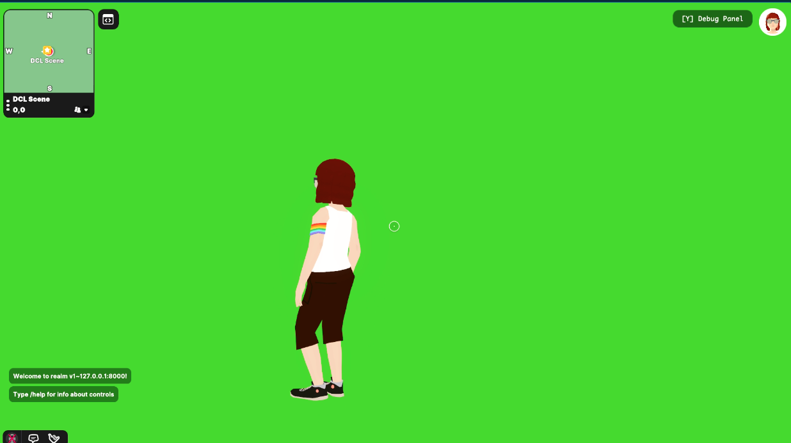

# Green Screen





A simple single-parcel Green Screen Scene. Ideal for photoshoots and showing off wearables or emotes in videos. 

You can switch background colors by clicking on the different sphere buttons.


## Try it out

**Install the CLI**

Download and install the Decentraland CLI by running the following command:

```
$ npm i -g decentraland
```

**Previewing the scene**

Download this example and navigate to its directory, then run:

```
$  dcl start
```